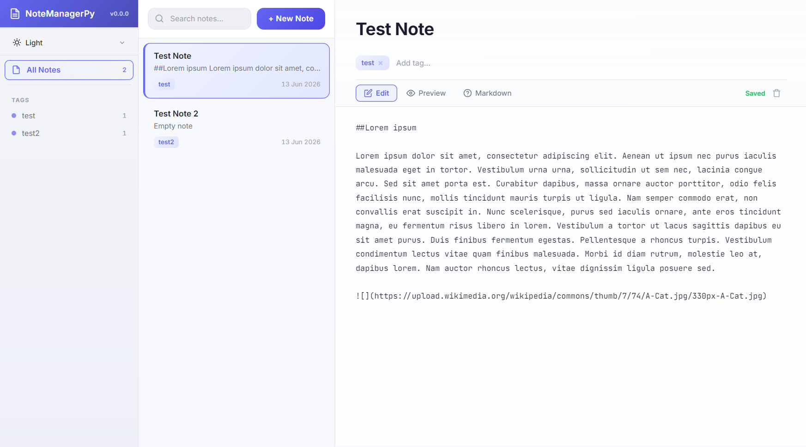
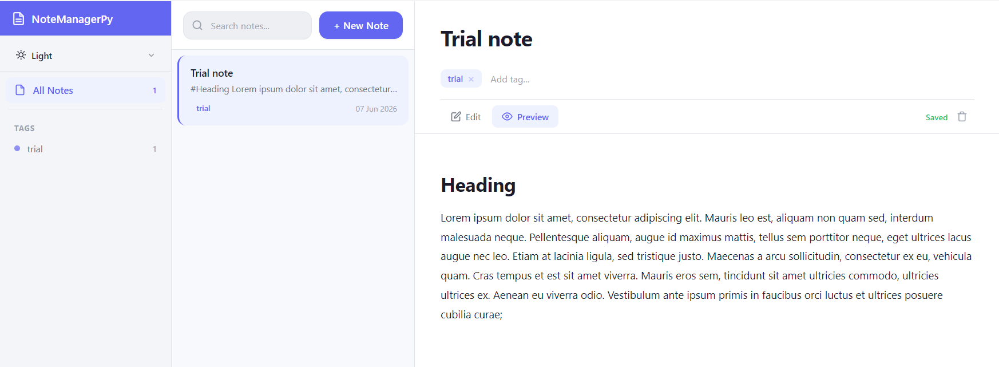

# NoteManagerPy

[](LICENSE)
[](https://github.com/bishwaruppaul/notemanager-py/releases)
[](https://github.com/bishwaruppaul/notemanager-py/releases)
[](https://github.com/bishwaruppaul/notemanager-py/releases)

A **portable**, **browser-based** note manager — no installation, no cloud, no AI. Double-click the executable, it opens instantly in your default browser with minimal resource usage. Close the tab and it's gone.

<div align="center">
  <h3>Screenshots</h3>

  <!-- Slide 1 -->
  <details open>
    <summary><b>Editing</b></summary>
    <br>
    
  </details>

  <!-- Slide 2 -->
  <details>
    <summary><b>Preview</b></summary>
    <br>
    
  </details>

</div>


**NoteManagerPy** is the spiritual successor to [NoteManageR](https://github.com/bishwaruppaul/NoteManageR), reimagined as a web app with a rich editor, Markdown rendering, and a material-design three-panel layout.

> **Why NoteManagerPy?**
>
> - **Simple plain-text notes** — no database, no proprietary format. Your notes are `.txt` files on disk.
> - **100 % offline** — everything runs locally on your machine. No internet required, no cloud dependency.
> - **Zero telemetry, zero AI** — no AI features, no data collection, no phoning home. Your notes never leave your computer.
> - **Sync on your terms** — want to sync? Drop the `notes/` folder into Dropbox, Google Drive, Syncthing, or any cloud provider. No vendor lock-in.
> - **Private by design** — all information stays completely under your control. There is no account, no sign-up, and no server but your own.

> *Taking notes in plain text is rather simplistic, easy, portable and future-proof.*
> — Derek Sivers, Szymon Krajewski

| Original (R CLI) | This (Desktop web app) |
|---|---|
| Terminal-based, keyboard only | Three-panel GUI with mouse and keyboard |
| Plain text editing in system editor | Inline editor with auto-save |
| No Markdown preview | Live Markdown rendering |
| All notes in a flat directory | Folder organization with subdirectories |
| Single color scheme | 6 themes (Light, Dark, Sepia, Solarized, One Dark, Nord, Dracula) |
| Requires R installation | Standalone executable — zero dependencies |

---

## Features

- **Three-panel layout** — sidebar tags & folders, note list, inline editor
- **Folder organization** — group notes into subdirectories, create folders from the sidebar, filter by folder
- **Auto-save** — debounced, with save-status indicator
- **Markdown rendering** — write in Markdown, see it formatted
- **Tag organization** — autocomplete, filter by tag, sidebar tag cloud
- **6 themes** — Light, Sepia, Solarized Light, One Dark, Nord, Dracula — persisted to localStorage
- **Search** — full-text search across all notes
- **Material design** — elevation, ripple effects, smooth transitions
- **Zero install** — single executable, no Python, no browser extensions
- **Offline** — everything runs locally, no internet needed

---

## Quick start

### Windows

Download `NoteManagerPy-Windows.exe` from the [latest release](https://github.com/bishwaruppaul/notemanager-py/releases) and double-click it.

### Linux

```bash
chmod +x NoteManagerPy-Linux
./NoteManagerPy-Linux
```

### macOS

```bash
chmod +x NoteManagerPy-macOS
./NoteManagerPy-macOS
```

The app opens at [http://127.0.0.1:5000](http://127.0.0.1:5000).

---

## Usage

### Create a note

Click the **+** button. Type a title, add tags (existing tags autocomplete), and write in Markdown. The note auto-saves as you type.

### Search notes

Use the search bar at the top. Results update as you type, matching note titles and content.

### Organize with folders

Create folders from the sidebar to group related notes. When creating or editing a note, assign it to a folder using the dropdown in the editor toolbar. Click a folder in the sidebar to filter notes by that folder only. Folders correspond to subdirectories in `notes/` on disk.

### Filter by tag

Click a tag in the sidebar to show only notes with that tag. Click again to deselect.

### Read / Edit

Click any note in the list to open it in the editor. Changes auto-save. Press `Escape` to close and return to the list.

### Change theme

Use the theme dropdown in the top bar. Your preference is saved across sessions.

---

## Themes

| Theme | Preview |
|---|---|
| Light | Clean white background, dark text |
| Sepia | Warm paper-toned background |
| Solarized Light | Solarized light color scheme |
| One Dark | Atom One Dark syntax colors |
| Nord | Arctic, bluish dark theme |
| Dracula | Dark purple-based theme |

---

## Build from source

```bash
pip install -r requirements.txt
python scripts/build.py
```

The executable appears in the project root.

### Platform-specific flags

- **Windows**: `--windowed` (no console window), `.exe` output
- **macOS**: `--windowed` (`.app` bundle on macOS, regular binary on CI)

Override output name: `$env:NM_OUTPUT_NAME="MyApp"` (Windows) or `NM_OUTPUT_NAME="MyApp"` (Linux/macOS).

---

## Release a new version

```bash
python scripts/release.py 1.0.0
```

This pushes a `v1.0.0` tag. GitHub Actions builds all three platforms and creates a GitHub Release with the executables attached.

You can also trigger a release manually from the [Actions tab](https://github.com/bishwaruppaul/notemanager-py/actions) — enter a tag name, and the workflow will build and publish.

---

## Notes and compatibility

Notes are stored as `.txt` files in the `notes/` directory, compatible with the original [NoteManageR](https://github.com/bishwaruppaul/NoteManageR) R script format:

```
Tags: work, project
Created: 06 Jun 2026, 02:30 PM

Note content goes here...
```

The first two lines (`Tags:` and `Created:`) are metadata. Everything below is Markdown content. You can move notes from the original NoteManageR into this app and vice versa.

---

## License

GNU General Public License v3.0 — see [LICENSE](LICENSE).

---

*Inspired by [NoteManageR](https://github.com/bishwaruppaul/NoteManageR) and the philosophy of plain-text note-taking.*
